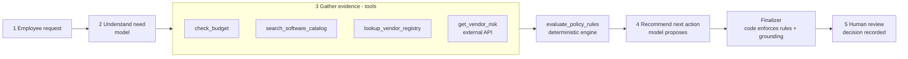
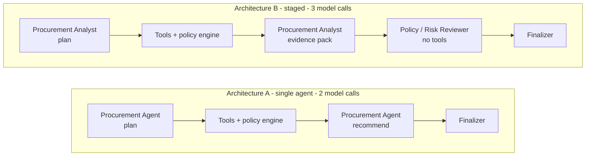

# procurement-copilot

**AI Procurement Request Copilot** - FDE Assessment 3.

An internal tool that inspects a software or service purchase request, gathers evidence with tools, applies the procurement policy in code, and recommends the next action. It never approves anything: every decision stays with a human.

> All companies, vendors, products, employees, prices, policies and risk signals are synthetic assessment data.

## What it does

For each request the copilot returns the required output: **recommendation, evidence, approvals required, missing information, risk flags and next step**, plus a human-review flag that is always true.

| | Owner | Examples |
|---|---|---|
| **AI** | interprets and recommends | understands the need, reads sensitive data out of free text, judges overlap with existing tools, proposes the action, writes findings |
| **Code** | decides the rules | required fields, budget check, approval thresholds, Security / Privacy / Legal triggers, 365-day review expiry, source conflicts, outage handling, grounding checks |
| **Human** | approves | every approval and exception, recorded in an audit log |

The model can make a result more conservative. It cannot remove an approval, a policy flag or a missing-information item.

## Quick start

Python 3.11 or 3.12.

```bash
python -m venv .venv
source .venv/bin/activate                 # Windows: .\.venv\Scripts\Activate.ps1
python -m pip install -r requirements.txt
cp .env.example .env                      # add one model key - see below
python verify_setup.py                    # expect PRE-FLIGHT PASSED
python run_local.py                       # one command: mock vendor-risk API + UI
```

Then open http://127.0.0.1:8501.

**Model key.** Any OpenAI-compatible endpoint works; no provider SDK is needed. Set one of these in `.env`:

| Provider | Variables | Notes |
|---|---|---|
| Groq (used for all results here) | `GROQ_API_KEY`, optional `MODEL_NAME` | default model `openai/gpt-oss-120b`; free key at console.groq.com/keys |
| Google Gemini | `GEMINI_API_KEY`, optional `MODEL_NAME` | implemented through Gemini's OpenAI-compatible endpoint; not exercised in this repo's results |
| Other | `LLM_BASE_URL`, `LLM_API_KEY`, `MODEL_NAME` | any chat-completions endpoint that supports `json_schema` response format |

Without a key the app still runs: it returns the deterministic checks only and says so.

## Workflow



The product UI has the three required panels - **request details**, **evidence**, **recommendation and next action** - plus a trace of how the result was produced, an A/B comparison mode, a new-request form, and a **human decision** form that writes to `var/human_review_log.jsonl`.

## Tools

Five tools, all registered in `src/tools.py`; four are deterministic.

| Tool | Kind | Purpose |
|---|---|---|
| `check_budget` | deterministic | cost vs the department's available software budget; requester's department and manager |
| `search_software_catalog` | deterministic | existing approved software for the same product, vendor, category or need; last purchase |
| `lookup_vendor_registry` | deterministic | internal onboarding, security and legal-terms status; review age at the policy reference date |
| `get_vendor_risk` | external HTTP API | vendor-risk service; distinguishes `ok`, `not_found`, `unavailable` and `invalid_response` |
| `evaluate_policy_rules` | deterministic | the policy engine: missing fields, approvals, risk flags, and the rule behind each |

Every tool execution is a numbered entry in an **evidence ledger**. Tool summaries and policy-rule findings are generated by code, so they are grounded by construction. A model-written finding is kept only if it cites ledger entries and every figure or date in it appears in them.

The agent chooses which tools to call and with what arguments, but policy makes four checks mandatory. The policy engine therefore always works from calls addressed from the request record itself; if the agent skips one or looks up the wrong vendor, the harness runs the correct call and marks it in the ledger.

## Agents and architectures

Both architectures share the tools, the policy engine, the finalizer and the output contract. Only the orchestration differs.



- **A - single-agent baseline** (`src/agents/single.py`). One agent plans the evidence gathering, reads the results and recommends.
- **B - staged, two agents** (`src/agents/staged.py`). A Procurement Analyst gathers evidence and writes a structured pack without recommending. A Policy/Risk Reviewer with no tools checks the pack against the tool results, can reject findings, and chooses the action. The reviewer sees structured request fields, deterministic tool summaries and the policy output, but not the requester's free-text justification or vendor notes.

Structured output is enforced with strict JSON schemas at every model call. Tool requests are **batched** in one structured response rather than made through native function calling: on the models used, native calling returns one tool per turn and cannot be combined with schema-constrained output, which would roughly triple token use against a free-tier limit of 8,000 tokens per minute.

Details, responsibilities and escalation conditions: [`docs/workflow_and_architecture.md`](docs/workflow_and_architecture.md).

## Reliability and human controls

| Edge case | Behaviour |
|---|---|
| Incomplete or ambiguous request | `request_clarification`; missing fields listed; no approval tier invented when cost is absent |
| Existing tool already solves the need | overlap surfaced with the catalog entry; `review_existing_tool_first` when no credible gap is given |
| Conflicting or expired vendor information | both sources shown, neither preferred; `manual_review`; expiry computed against the policy reference date (2026-09-30), never the system clock |
| Security-sensitive request or approval threshold | reviewers and approval tier added by code from the policy |
| Prompt injection inside business data | text treated as data; flagged `prompt_injection_detected`; approvals are not under the model's control, so they cannot change |
| Tool or API unavailable | no favourable status inferred; `vendor_risk_unavailable`; `manual_review`; Security added |
| Model unavailable or out of quota | deterministic-only decision, flagged `llm_unavailable` |

## Evaluation

```bash
python -m pytest tests -q                                # 126 tests, no model required
python evals/run_public_evals.py --architecture single   # the starter's six public cases
python evals/run_public_evals.py --architecture staged
python evals/run_comparison.py                           # A vs B on the same 18 cases
python evals/run_comparison.py --report-only             # rebuild reports from saved runs
```

`run_comparison.py` runs both architectures back to back on the same 18 cases: the 10 requests in `data/requests.json` (which include the six public cases) and 8 fixture cases on a separate data snapshot (`evals/fixtures/data/`) that stand in for hidden cases - injection inside vendor notes, a vendor unknown to both sources, sensitive data described only in free text, a false pre-approval claim, exact threshold boundaries, a one-day-expired review, and an API timeout.

Scoring is deterministic, with no LLM judge. A case passes when all four hold:

| Criterion | Definition |
|---|---|
| Correct next action | the final action is one the case accepts |
| Grounded evidence | no model-written finding or claim had to be discarded by the grounding checks |
| Policy followed | approvals match exactly; required flags present; forbidden flags absent; missing information as expected |
| Human escalation correct | human review required; every expected specialist reviewer listed; nothing waved through |

It also records the model's proposed action **before** the code guardrail, the processing latency (model plus tool time, with free-tier quota waits reported separately), model calls, tool calls and tokens.

<!-- RESULTS -->

## Assumptions

The full list is in [`docs/workflow_and_architecture.md`](docs/workflow_and_architecture.md#assumptions). The ones that most affect outcomes:

- "Department Head" and "Manager" are approval roles; they are not resolved to named people.
- An empty integrations list means "none required"; only a null field is missing information.
- A review is current through day 365. Registry and risk service "disagree" when their stated statuses or review dates differ.
- A vendor is "new" if the registry says New or does not list it. A 404 from the risk service means no assessment on record, not an outage.
- Over-budget or unverifiable-budget requests add Finance as a budget-exception reviewer.
- Sensitive data stored outside the operating region adds Privacy and Legal.
- Overlap is flagged in code for the same product or a same-category product from another vendor; same-vendor add-ons and expansions are left to the model's judgement.

## Starter-pack issues found and fixed

| Issue | Fix |
|---|---|
| Mock API URL-decoded the vendor name a second time, so a name containing `%` returned a false 404 | removed the second decode; names with `/` now route too; regression test over real HTTP |
| Vendor client raised one exception for 404, 503 and timeouts alike | typed outcomes; one retry for transient failures; never raises |
| Public eval runner assumed the mock API was running; if not, every case looked like a model failure | the eval scripts check and start the API themselves |
| `.gitignore` excluded eval results, which are a deliverable | curated results are committed under `evals/results/` |
| Launcher hard-coded port 8001 and could block on Streamlit's first-run prompt | address derived from `VENDOR_RISK_BASE_URL`; headless start |
| Data loaders coerced blanks to NaN and were easy to cache at import | per-call CSV reads with blanks kept as blanks |
| "Go To Market" department has employees but no budget row | reported as `budget_unverified` and routed to Finance, not assumed available |

## Known limitations

- **Small evaluation set, one trial per case.** 18 cases cannot establish a statistically meaningful difference between architectures, and model output varies between runs. `--trials N` exists; the free-tier daily quota allowed one full pass per model.
- **Expected outcomes were written by the same person as the policy engine.** They agree by construction on the deterministic parts; an independent labeller could disagree with my reading of the policy.
- **Prompts were tuned on the public requests.** One prompt change was made after early runs (see commit history). The fixture cases were written before any model run on them, but they are not a blind hold-out.
- **Grounding checks cover figures, dates, product names and evidence ids**, not every word. A finding can still mis-state a non-numeric fact and pass.
- **The injection scanner is pattern-based** and will miss novel phrasing. The protection that does not depend on it is that approvals are computed in code.
- **Model-inferred data classes can over-escalate.** A model that reads sensitivity into a benign request adds a review that a human then has to dismiss.
- **Free-tier rate limits** (8,000 tokens/minute) make back-to-back runs pause for up to a minute.
- **Not built:** authentication and roles, a real audit store, approver lookup, deployment, a Gemini-path test run.

## Repository map

```text
app.py, run_local.py, verify_setup.py     UI, one-command launcher, pre-flight check
src/                                      contracts, tools, policy engine, agents, finalizer, model client
mock_api/                                 mock vendor-risk service
data/                                     business data snapshot and the procurement policy
evals/                                    public runner, comparison runner, cases, fixtures, results
tests/                                    unit, pipeline, UI and eval-set tests
docs/                                     brief, workflow and architecture, decision memo
```
