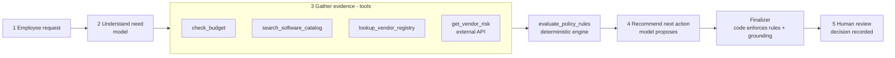
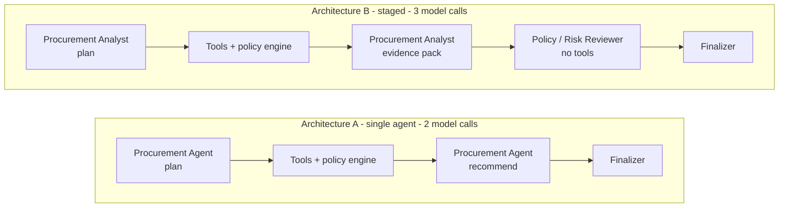

# procurement-copilot

**AI Procurement Request Copilot** - FDE Assessment 3.

An internal tool that inspects a software or service purchase request, gathers evidence with tools, applies the procurement policy in code, and recommends the next action. It never approves anything: every decision stays with a human.

> All companies, vendors, products, employees, prices, policies and risk signals are synthetic assessment data.

## What it does

For each request the copilot returns the required output: **recommendation, evidence, approvals required, missing information, risk flags and next step**, plus a human-review flag that is always true.

| | Owner | Examples |
|---|---|---|
| **AI** | interprets and recommends | understands the need, reads sensitive data out of free text, judges overlap with existing tools, proposes the action, writes findings |
| **Code** | decides the rules | required fields, budget check, approval thresholds, Security / Privacy / Legal triggers, 365-day review expiry, source conflicts, outage handling, grounding checks |
| **Human** | approves | every approval and exception, recorded in an audit log |

The model can make a result more conservative. It cannot remove an approval, a policy flag or a missing-information item.

## Quick start

Python 3.11 or 3.12.

```bash
python -m venv .venv
source .venv/bin/activate                 # Windows: .\.venv\Scripts\Activate.ps1
python -m pip install -r requirements.txt
cp .env.example .env                      # add one model key - see below
python verify_setup.py                    # expect PRE-FLIGHT PASSED
python run_local.py                       # one command: mock vendor-risk API + UI
```

Then open **http://127.0.0.1:8501**. The address is fixed: the launcher prints it when the UI is ready, and if port 8501 is taken it stops with an error instead of moving to another port. `http://127.0.0.1:8001` is the mock vendor-risk API, not a web page.

`run_local.py`, `verify_setup.py` and the evaluation scripts re-run themselves under `.venv` if started from another Python (for example an active conda environment), so they work without activating it first. `pytest` does not: run it as `.venv/bin/python -m pytest tests -q` or with the environment activated.

**Model key.** Any OpenAI-compatible endpoint works; no provider SDK is needed. Set one of these in `.env`:

| Provider | Variables | Notes |
|---|---|---|
| Google Gemini (recommended) | `GEMINI_API_KEY`, optional `MODEL_NAME` | default model `gemini-3.5-flash-lite`; free key at aistudio.google.com/apikey |
| Groq | `GROQ_API_KEY`, optional `MODEL_NAME` | default model `openai/gpt-oss-120b`; free key at console.groq.com/keys; 8,000 tokens/minute on the free tier |
| Other | `LLM_BASE_URL`, `LLM_API_KEY`, `MODEL_NAME` | any chat-completions endpoint that supports `json_schema` response format |

If more than one key is set, choose with `LLM_PROVIDER=gemini` or `LLM_PROVIDER=groq`. `LLM_PROVIDER=none` switches the model off.

Without a key the app still runs: it returns the deterministic checks only and says so.

## Workflow



The product UI has the three required panels - **request details**, **evidence**, **recommendation and next action** - plus a trace of how the result was produced, an A/B comparison mode, a new-request form, and a **human decision** form that writes to `var/human_review_log.jsonl`.

## Tools

Five tools, all registered in `src/tools.py`; four are deterministic.

| Tool | Kind | Purpose |
|---|---|---|
| `check_budget` | deterministic | cost vs the department's available software budget; requester's department and manager |
| `search_software_catalog` | deterministic | existing approved software for the same product, vendor, category or need; last purchase |
| `lookup_vendor_registry` | deterministic | internal onboarding, security and legal-terms status; review age at the policy reference date |
| `get_vendor_risk` | external HTTP API | vendor-risk service; distinguishes `ok`, `not_found`, `unavailable` and `invalid_response` |
| `evaluate_policy_rules` | deterministic | the policy engine: missing fields, approvals, risk flags, and the rule behind each |

Every tool execution is a numbered entry in an **evidence ledger**. Tool summaries and policy-rule findings are generated by code, so they are grounded by construction. A model-written finding is kept only if it cites ledger entries and every figure or date in it appears in them.

The agent chooses which tools to call and with what arguments, but policy makes four checks mandatory. The policy engine therefore always works from calls addressed from the request record itself; if the agent skips one or looks up the wrong vendor, the harness runs the correct call and marks it in the ledger.

## Agents and architectures

Both architectures share the tools, the policy engine, the finalizer and the output contract. Only the orchestration differs.



- **A - single-agent baseline** (`src/agents/single.py`). One agent plans the evidence gathering, reads the results and recommends.
- **B - staged, two agents** (`src/agents/staged.py`). A Procurement Analyst gathers evidence and writes a structured pack without recommending. A Policy/Risk Reviewer with no tools checks the pack against the tool results, can reject findings, and chooses the action. The reviewer sees structured request fields, deterministic tool summaries and the policy output, but not the requester's free-text justification or vendor notes.

Structured output is enforced with strict JSON schemas at every model call. Tool requests are **batched** in one structured response rather than made through native function calling. The design was built against Groq's gpt-oss models, where native calling returned one tool per turn and could not be combined with schema-constrained output; batching cut token use to about a third against a free-tier limit of 8,000 tokens per minute. The same request format worked unchanged on Gemini.

Details, responsibilities and escalation conditions: [`docs/workflow_and_architecture.md`](docs/workflow_and_architecture.md).

## Reliability and human controls

| Edge case | Behaviour |
|---|---|
| Incomplete or ambiguous request | `request_clarification`; missing fields listed; no approval tier invented when cost is absent |
| Existing tool already solves the need | overlap surfaced with the catalog entry; `review_existing_tool_first` when no credible gap is given |
| Conflicting or expired vendor information | both sources shown, neither preferred; `manual_review`; expiry computed against the policy reference date (2026-09-30), never the system clock |
| Security-sensitive request or approval threshold | reviewers and approval tier added by code from the policy |
| Prompt injection inside business data | text treated as data; flagged `prompt_injection_detected`; approvals are not under the model's control, so they cannot change |
| Tool or API unavailable | no favourable status inferred; `vendor_risk_unavailable`; `manual_review`; Security added |
| Model unavailable or out of quota | deterministic-only decision, flagged `llm_unavailable` |

## Evaluation

```bash
python -m pytest tests -q                                # 138 tests, no model required
python evals/run_public_evals.py --architecture single   # the starter's six public cases
python evals/run_public_evals.py --architecture staged
MODEL_NAME=gemini-3.5-flash-lite python evals/run_comparison.py --replay   # reproduce the Flash-Lite table offline, no key needed
MODEL_NAME=openai/gpt-oss-20b python evals/run_comparison.py --replay      # same for gpt-oss-20b
python evals/run_comparison.py --out evals/results/my-run               # a new live A-vs-B run on the same 18 cases
```

`--replay` feeds the recorded model outputs back through the real tools, policy engine and finalizer, so the published Flash-Lite and 20b numbers can be reproduced without a model key. A live run needs a key and about 90 model calls (130,000-160,000 tokens): a few minutes on Gemini Flash-Lite, about 25 minutes and most of a day's quota on Groq's free tier.

`run_comparison.py` runs both architectures back to back on the same 18 cases: the 10 requests in `data/requests.json` (which include the six public cases) and 8 fixture cases on a separate data snapshot (`evals/fixtures/data/`) that stand in for hidden cases - injection inside vendor notes, a vendor unknown to both sources, sensitive data described only in free text, a false pre-approval claim, exact threshold boundaries, a one-day-expired review, and an API timeout.

Scoring is deterministic, with no LLM judge. A case passes when all four hold:

| Criterion | Definition |
|---|---|
| Correct next action | the final action is one the case accepts |
| Grounded evidence | no model-written finding or claim had to be discarded by the grounding checks |
| Policy followed | approvals match exactly; required flags present; forbidden flags absent; missing information as expected |
| Human escalation correct | human review required; every expected specialist reviewer listed; nothing waved through |

It also records the model's proposed action **before** the code guardrail, the processing latency (model plus tool time, with free-tier quota waits reported separately), model calls, tool calls and tokens.

## Evaluation results

Both architectures, the same 18 cases, one trial per case, on three models. Full reports are in `evals/results/<model>/summary.md`.

| Model | Architecture | Cases passing all four criteria | Correct next action | Avg latency | LLM calls | Tool calls | Tokens |
|---|---|---:|---:|---:|---:|---:|---:|
| Gemini 3.5 Flash-Lite | A single | 17/18 | 17/18 | 4.2 s | 2.00 | 5.00 | 2,845 |
| Gemini 3.5 Flash-Lite | B staged | 18/18 | 18/18 | 6.6 s | 3.00 | 5.00 | 4,331 |
| gpt-oss-120b (Groq) | A single | 16/18 | 17/18 | 3.5 s | 2.00 | 5.00 | 3,547 |
| gpt-oss-120b (Groq) | B staged | 16/18 | 16/18 | 5.0 s | 3.06 | 5.06 | 5,450 |
| gpt-oss-20b (Groq) | A single | 16/18 | 16/18 | 2.4 s | 2.06 | 5.06 | 3,519 |
| gpt-oss-20b (Groq) | B staged | 16/18 | 16/18 | 3.7 s | 3.06 | 5.06 | 5,184 |
| **All three** | **A single** | **49/54** | | | | | |
| **All three** | **B staged** | **50/54** | | | | | |

Latency is model plus tool time. Waiting for free-tier quota is excluded and reported separately in each `results.csv`: on Groq it averaged 18-19 s per request for A and 26-31 s for B; on Gemini Flash-Lite it was 0 s for A and 6 s for B.

- **Evidence grounded:** 18/18 for every model and architecture. On the two fully recorded models, 230 model-written findings were kept and none discarded. The check covers figures, dates, product names and evidence ids, not every word.
- **Public cases:** `python evals/run_public_evals.py` passes 6/6 for both `--architecture single` and `--architecture staged` on Flash-Lite. Inside the comparison, the six public cases also met the starter's minimum checks on both architectures on 20b; on 120b all six passed the stricter four-criteria scoring. With the model switched off (`LLM_PROVIDER=none`) the deterministic layer alone passes all six.
- **Mandatory tools skipped by the agent:** none, in any recorded run.

**What failed.** Nine of 108 runs, and every one is in the single judgement left to the model: whether an existing tool already covers the need.

| Run | What happened |
|---|---|
| A, Flash-Lite, DS-08 | Judged a duplicate of a company-wide tool to be an expansion and sent it to standard approval |
| A, 120b, DS-08 | Right action (review existing tool) but the overlap flag was missing. Fixed afterwards: that action now always carries the flag |
| A, 120b, DS-10 | Asked to review the existing tool for a low-value training pack; should have proceeded |
| B, 120b, DS-08 | Sent the duplicate to standard approval |
| B, 120b, FX-02 | Routed for reviews; should have checked the existing BI tool first because no gap was stated |
| A, 20b, DS-01 | Asked to review the existing tool for a three-seat add-on; should have proceeded |
| A, 20b, DS-08 | Proposed clarification, which policy did not allow; the override fell back to standard approval |
| B, 20b, FX-02 | Same as on 120b |
| B, 20b, FX-03 | Security and Privacy were added correctly, but the final action was to check the existing tool instead of routing for reviews |

No run got an approval list, threshold, review expiry, source conflict, outage or injection case wrong. Those are decided in code that both architectures share.

**How these numbers were produced.**

- **Flash-Lite:** one uninterrupted live run on the final code. `runs.jsonl` is the complete record.
- **20b:** the complete record is `runs_live.jsonl`; the table is that record replayed through the final code (`--replay`). One outcome differs from the live run, because a product named "NeuralDesk Business (SW009)" was at first rejected as not in the catalog. The run was interrupted once and resumed after a retry fix.
- **120b:** the detailed per-run record was lost to a bug in the first version of the replay mode, so the table was rebuilt from the run's console output (`live_console.log`). Counters the console does not print are marked "not recorded" in its summary. The runner now refuses to discard recorded runs and has tests for that.
- One prompt change was made after early 120b runs showed both architectures reading "internal documents" as confidential. All three full runs use the final prompts.

## Comparison and ship decision

**Ship Architecture A, the single agent.** The memo is [`docs/architecture_decision.md`](docs/architecture_decision.md).

- **Quality is close to a tie.** A passed 49 of 54 case-runs and B passed 50. B was one case better on Flash-Lite and level on the other two models.
- **Cost is consistently different.** On all three models B makes one more model call and uses about 50% more tokens and 45-55% more latency per request.
- **Where B helped.** On the duplicate-tool case (DS-08), B chose correctly on two models where A did not; on the third it was the other way round. A sent that duplicate to standard approval twice, B once.
- **Why that does not decide it.** The failure is contained: the request still goes to human approvers, and the evidence panel shows the existing product and the rule asking them to confirm it is not a duplicate. A code-level default for ambiguous same-vendor overlap would target the same failure without a second model call, and is the next thing to test.
- **B's structural advantage did not show up.** Its reviewer sees no requester free text or vendor notes, but every injection case came out right in both architectures, because approvals are outside the model's control in both.

Reliability here comes from the shared parts: the policy engine, mandatory evidence checks, grounding checks and the human decision. One trial per case cannot separate 49/54 from 50/54; if repeated trials showed B reliably catching duplicates that A misses, and a code-level default did not close the gap, B would be the better choice.

**Model choice.** Use **Gemini 3.5 Flash-Lite**. It had the best pass rates of the three, used the fewest tokens, and ran the whole comparison with almost no quota waiting, where Groq's free tier pauses about 20-30 s per request. `gpt-oss-120b` is the fallback. Two other Gemini models were tried on a five-case subset and rejected: Gemini 3.8 Flash took 85 s on one request and then returned "high demand" errors, and Gemini 3.5 Flash took 6-22 s per request and hit its per-minute limit. All of this is one trial per case, so treat the ranking as indicative.

## Assumptions

The full list is in [`docs/workflow_and_architecture.md`](docs/workflow_and_architecture.md#assumptions). The ones that most affect outcomes:

- "Department Head" and "Manager" are approval roles; they are not resolved to named people.
- An empty integrations list means "none required"; only a null field is missing information.
- A review is current through day 365. Registry and risk service "disagree" when their stated statuses or review dates differ.
- A vendor is "new" if the registry says New or does not list it. A 404 from the risk service means no assessment on record, not an outage.
- Over-budget or unverifiable-budget requests add Finance as a budget-exception reviewer.
- Sensitive data stored outside the operating region adds Privacy and Legal.
- Overlap is flagged in code for the same product or a same-category product from another vendor; same-vendor add-ons and expansions are left to the model's judgement.

## Starter-pack issues found and fixed

| Issue | Fix |
|---|---|
| Mock API URL-decoded the vendor name a second time, so a name containing `%` returned a false 404 | removed the second decode; names with `/` now route too; regression test over real HTTP |
| Vendor client raised one exception for 404, 503 and timeouts alike | typed outcomes; one retry for transient failures; never raises |
| Public eval runner assumed the mock API was running; if not, every case looked like a model failure | the eval scripts check and start the API themselves |
| `.gitignore` excluded eval results, which are a deliverable | curated results are committed under `evals/results/` |
| Launcher hard-coded port 8001 and could block on Streamlit's first-run prompt | address derived from `VENDOR_RISK_BASE_URL`; headless start |
| Launcher started only the API when Streamlit was missing from the active Python, with no UI and no error | scripts switch to `.venv`; the launcher fails clearly if the UI cannot start and prints the UI address when it is ready |
| Data loaders coerced blanks to NaN and were easy to cache at import | per-call CSV reads with blanks kept as blanks |
| "Go To Market" department has employees but no budget row | reported as `budget_unverified` and routed to Finance, not assumed available |

## Known limitations

- **Small evaluation set, one trial per case.** 18 cases cannot establish a statistically meaningful difference between architectures, and model output varies between runs. `--trials N` exists; the free-tier daily quota allowed one full pass per model.
- **The 120b detailed record is missing.** Its table was rebuilt from console output, so those runs cannot be replayed or inspected finding by finding. `python evals/run_comparison.py --overwrite` regenerates it.
- **Overlap judgement is the weak point.** All eight failures are there, in both architectures. Ambiguous overlap can currently fall through to standard approval; a safer default would send it to a human check.
- **Expected outcomes were written by the same person as the policy engine.** They agree by construction on the deterministic parts; an independent labeller could disagree with my reading of the policy.
- **Prompts were tuned on the public requests.** One prompt change was made after early runs (see commit history). The fixture cases were written before any model run on them, but they are not a blind hold-out.
- **Grounding checks cover figures, dates, product names and evidence ids**, not every word. A finding can still mis-state a non-numeric fact and pass.
- **The injection scanner is pattern-based** and will miss novel phrasing. The protection that does not depend on it is that approvals are computed in code.
- **Model-inferred data classes can over-escalate.** A model that reads sensitivity into a benign request adds a review that a human then has to dismiss.
- **Free-tier rate limits.** On Groq (8,000 tokens/minute) back-to-back runs pause for up to a minute. Gemini's free-tier limits are not published; Flash-Lite ran the full comparison with only a few short pauses, but its daily allowance was not measured.
- **Not built:** authentication and roles, a real audit store, approver lookup, deployment.

## Repository map

```text
app.py, run_local.py, verify_setup.py     UI, one-command launcher, pre-flight check
project_env.py                            re-runs scripts under .venv when started from another Python
src/                                      contracts, tools, policy engine, agents, finalizer, model client
mock_api/                                 mock vendor-risk service
data/                                     business data snapshot and the procurement policy
evals/                                    public runner, comparison runner, cases, fixtures, results
tests/                                    unit, pipeline, UI and eval-set tests
docs/                                     brief, workflow and architecture, decision memo
```
