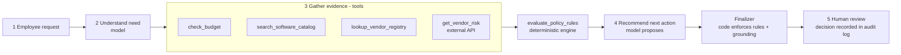
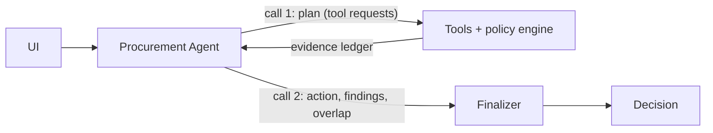
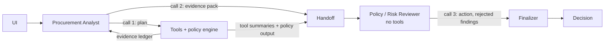

# Workflow and architecture

## Workflow

The same five steps run in both architectures. Steps 2 and 4 are the only places a model is involved.

## Who decides what

| Responsibility | Owner | Where |
|---|---|---|
| Understand the need; choose search keywords; read sensitive data classes out of free text | Model | `src/agents/` |
| Judge whether an existing tool already covers the need | Model, but it must name a product the catalog tool returned | `src/finalizer.py` |
| Propose the next action and write the rationale and key findings | Model | `src/agents/` |
| Required fields, budget rule, approval thresholds, Security / Privacy / Legal triggers, 365-day review expiry, registry-vs-service conflict, outage handling | Code | `src/policy_engine.py` |
| Accept or override the proposed action; drop findings that do not match the cited tool results; always require human review | Code | `src/finalizer.py` |
| Approve, reject, grant exceptions | Human | UI "Human decision" form, `var/human_review_log.jsonl` |

The model can make an outcome more conservative (for example by reading "salary files for all staff" as employee PII, which adds Security and Privacy review). It cannot remove an approval, a policy flag or a missing-information item, and it cannot set `human_review_required` to false.

## Tools

All five are registered in `src/tools.py`. Every execution becomes a numbered entry in the evidence ledger (E1, E2, ...), and a model-written finding is kept only if it cites ledger entries and every figure or date in it appears in them.

| Tool | Kind | What it returns |
|---|---|---|
| `check_budget` | deterministic | Requester's department and manager; cost vs available budget; shortfall |
| `search_software_catalog` | deterministic | Catalog entries for the same product, vendor or category, plus keyword matches on the need; last purchase |
| `lookup_vendor_registry` | deterministic | Onboarding, security and legal-terms status; review age against the policy reference date |
| `get_vendor_risk` | external HTTP API | Security review status and date, risk level, data residency; or `not_found` / `unavailable` / `invalid_response` |
| `evaluate_policy_rules` | deterministic | Missing fields, required approvals, risk flags and the rule behind each |

Two properties matter for reliability:

- **Mandatory checks cannot be skipped.** The agent chooses which tools to call, but the policy engine always works from calls addressed from the request record itself. If the agent skips a check or looks up the wrong vendor, the harness runs the right call and the ledger marks it `harness`.
- **Tool requests are batched.** The model returns a list of tool requests as schema-constrained JSON and the harness runs them all. On the Groq-hosted models used here, native function calling returns one tool per turn and cannot be combined with schema-constrained output, which would cost roughly three times the tokens against an 8,000 tokens/minute limit.

## Architecture A - single agent

Two model calls. A third happens only if the agent asks for one more catalog search.

## Architecture B - staged, two agents

Three model calls. The analyst does not recommend. The reviewer has no tools and sees:

- the request's structured fields (not the requester's free-text justification),
- a deterministic one-line summary of each lookup and the full policy-engine output (not vendor notes),
- the analyst's pack: need summary, overlap assessment, numbered findings, open questions.

It can reject analyst findings by number, restate the overlap judgement, and choose the action.

Both architectures share the tools, the policy engine, the finalizer and the output contract, so the comparison measures orchestration only.

## Stop and escalation conditions

| Condition | Result |
|---|---|
| A required field is missing or unusable | `request_clarification`; no approval may be requested yet |
| Vendor-risk service down, timing out or returning garbage | `manual_review`, `vendor_risk_unavailable`, Security added; no favourable status inferred |
| Registry and risk service disagree | `manual_review`, `conflicting_vendor_evidence`, Security added; neither source preferred |
| Security / Privacy / Legal trigger, or budget exceeded or unverifiable | `route_for_reviews` with the specific reviewers |
| An existing tool plausibly covers the need and no gap is given | `review_existing_tool_first` |
| None of the above | `proceed_to_standard_approval` - still to human approvers |
| Model unavailable, out of quota or returning invalid output | Deterministic-only decision, flagged `llm_unavailable` |
| Instruction-like text in request or vendor data | Ignored; `prompt_injection_detected`; approvals unchanged |

## Assumptions

- **Department Head** and **Manager** are approval roles, not resolved to named people. The data gives a reporting line but no rule for who a department's head is.
- **An empty integrations list means "none required"**; only a null or absent field counts as missing.
- **A review is current for 365 days inclusive** of day 365. A review dated after the reference date is treated as not current.
- **Registry and service "disagree"** when their stated security statuses differ (for example Approved vs expired) or their review dates differ. Pending vs not_completed is agreement.
- **"New vendor"** means registry procurement status New, or not in the registry at all.
- **Legal terms** count as approved only when the registry says Approved or Standard.
- **"Sensitive data stored outside the region"** triggers Privacy and Legal when the request involves any sensitive data class and the risk service reports out-of-region storage.
- **Over-budget and unverifiable-budget requests** add Finance as a budget-exception reviewer even below the Finance tier.
- **Overlap** is flagged in code when the catalog has the same product, or a same-category product from another vendor. Same-vendor products (add-ons, seat expansions) are surfaced and left to the model's judgement.
- **A 404 from the risk service** means "no assessment on record" (Security review), not an outage.
- **SSO** is not treated as credential access.

## Intentionally not built

- No autonomous action: nothing purchases, approves, or edits budgets or vendor records.
- No third agent, planner/critic loop or agent framework.
- No vector store or retrieval over the policy: it is ten short sections, implemented as code with a test that fails if the document's thresholds drift from the code.
- No authentication or roles in the UI, no database (the audit log is a local JSONL file), no deployment.
- No LLM-as-judge in the evaluation; scoring is deterministic so it is reproducible.
